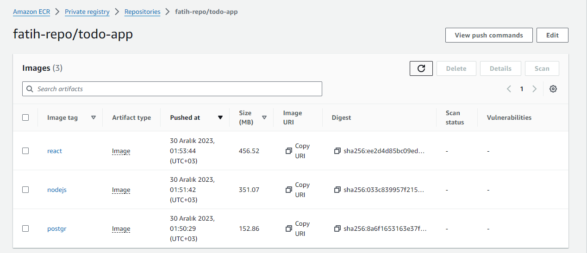

# Jenkins Pipeline for Web Page Application (Postgresql-Nodejs-React) deployed on AWS EC2's with Ansible and Docker

## Description
This project aims to create a Jenkins pipeline to deploy web-page written Nodejs and React Frameworks on AWS Cloud Infrastructure using Ansible. Building infrastructure process is managing with control node utilizing Ansible. This infrastructure has 1 jenkins server (`Amazon Linux 2 AMI`) as ansible control node and 3 EC2's as worker node (`Red Hat Enterprise Linux 9 with High Availability`). These EC2's will be launched on AWS console. Web-page has 3 main components which are postgresql, nodejs, and react. Each component is serving in Docker container on EC2s dedicated for them. Postgresql is serving as Database of web-page. Nodejs controls backend part of web-side and react controls frontend side of web-page.

## Project steps

### Step-1: Jenkisn Server Install with Terraform
In this step, we install our Jenkins server with Terraform. Change the required variables (such as keyname) in the variables.tf file in a way that suits you.

Then go to the jenkins_server folder (you should see files with .tf extension when you do ls) and enter the following commands.
```
terraform init
terraform apply or terraform apply -auto-approve
```
***The result will look like this and the url of the Jenkins Server will appear as output.***


### Step-2: Create a GitHub Repository for the Project
In this step, we go to our GitHub profile and create a repo for the project.


### Step-3: SSH to Jenkins Server and Pull Repo
We connect to our Jenkins server with ssh and clone the repo we created on GitHub here. NOT: We will add a token when cloning the repo, if you don't have one you can go to GitHub and get a new token from ```Profile > Settings > Developer settings > Personal access tokens > Tokens(classic) > Generate new token```.
Connect to Jenkins Server with SSH
```
ssh -i <key-name> ec2-user@<jenkins-server-public-ip>
```
We clone the repo as follows by adding tokens
```
git clone https://<token>@github.com/fatihabdioglu/my-todo-app.git
```

Paste the following code into the .bashrc file to color your terminal.
```
parse_git_branch() {
  git branch 2> /dev/null | sed -e '/^[^*]/d' -e 's/* \(.*\)/ (\1)/'
}
export PS1="\[\e[1;31m\]\u\[\e[33m\]@\h# \W:\[\e[32m\]\[\e[1;36m\]\$(parse_git_branch)$\[\033[00m\]"
```


### Step-4: Create Dockerfile for Nodejs, Postgresql and React
#### For Nodejs
Go to the nodejs folder, create a file named ```dockerfile-nodejs``` and paste the following commands into it.
```
FROM node:14

# Create app directory
WORKDIR /usr/src/app


COPY ./nodejs/server/package*.json ./

RUN npm install
# If you are building your code for production
# RUN npm ci --only=production


# copy all files into the image
COPY ./nodejs/server/ .

EXPOSE 5000

CMD ["node","app.js"]
```
#### For Postgresql
Go to the postgresql folder, create a file named ```dockerfile-postgresql``` and paste the following commands into it.
```
FROM postgres
COPY ./postgresql/init.sql /docker-entrypoint-initdb.d/
EXPOSE 5432
```
#### For React
Go to the react folder, create a file named ```dockerfile-react``` and paste the following commands into it.
```
FROM node:14

# Create app directory
WORKDIR /app


COPY ./react/client/package*.json ./

RUN yarn install

# copy all files into the image
COPY ./react/client/ .

EXPOSE 3000

CMD ["yarn", "run", "start"]
```
### Step-5: Creating Terraform files for React, Nodejs and Postgresql.
We will set up 3 Servers with Jenkins using Terraform. For this, we create a file named ```main.tf``` under the ```todo-app``` folder.
```
terraform {
  required_providers {
    aws = {
      source  = "hashicorp/aws"
      version = "~> 4.0"
    }
  }
  backend "s3" {
    bucket = "fatih-project-todo-app"
    key = "backend/tf-backend-jenkins.tfstate"
    region = "us-east-1"
    
  }
}

provider "aws" {
  region = "us-east-1"
}

variable "tags" {
  default = ["postgresql", "nodejs", "react"]
}


variable "user" {
  default = "fatih"
  
}

resource "aws_instance" "managed_nodes" {
  ami = "ami-023c11a32b0207432"
  count = 3
  instance_type = "t2.micro"
  key_name = "firstkey"
  vpc_security_group_ids = [aws_security_group.tf-sec-gr.id]
  iam_instance_profile = "jenkins-project-profile-${var.user}"
  tags = {
    Name = "ansible_${element(var.tags, count.index )}"
    stack = "ansible_project-1"
    environment = "development_1"
  }
}

resource "aws_security_group" "tf-sec-gr" {
  name = "project208-sec-gr"
  tags = {
    Name = "project208-sec-gr"
  }

  ingress {
    from_port   = 22
    protocol    = "tcp"
    to_port     = 22
    cidr_blocks = ["0.0.0.0/0"]
  }
  ingress {
    from_port   = 5000
    protocol    = "tcp"
    to_port     = 5000
    cidr_blocks = ["0.0.0.0/0"]
  }
  ingress {
    from_port   = 3000
    protocol    = "tcp"
    to_port     = 3000
    cidr_blocks = ["0.0.0.0/0"]
  }
  ingress {
    from_port   = 5432
    protocol    = "tcp"
    to_port     = 5432
    cidr_blocks = ["0.0.0.0/0"]
  }

  egress {
    from_port   = 0
    protocol    = -1
    to_port     = 0
    cidr_blocks = ["0.0.0.0/0"]
  }
}

output "react_ip" {
  value = "http://${aws_instance.managed_nodes[2].public_ip}:3000"
}

output "node_public_ip" {
  value = aws_instance.managed_nodes[1].public_ip

}

output "postgre_private_ip" {
  value = aws_instance.managed_nodes[0].private_ip

}
```
### Step-6: Create Ansible config and Dynamic Inventory file
We create a file called ```ansible.cfg``` under the ```todo-app``` folder.
```
[defaults]
host_key_checking = False
inventory = inventory_aws_ec2.yml
deprecation_warnings=False
interpreter_python=auto_silent
remote_user=ec2-user
```
We create a file called ```inventory_aws_ec2.yml``` under the ```todo-app``` folder. A dynamic inventory file is often used in environments where the infrastructure is more fluid, and hosts may be added or removed dynamically.
```
plugin: aws_ec2
regions:
  - "us-east-1"
filters:
  tag:stack: ansible_project-1
keyed_groups:
  - key: tags.Name
  - key: tags.environment
compose:
  ansible_host: public_ip_address
```
### Step-7: Create Playbook File for Ansible
Create a file named ```docker_project.yml``` under the todo-app folder.
```
- name: install docker and config
  hosts: _development_1
  become: true
  vars:
    aws_region: us-east-1
    ecr_registry: 460569671082.dkr.ecr.us-east-1.amazonaws.com # change aws account id
  tasks:
    - name: update all packages
      yum:
        name: '*'
        state: latest

    - name: Remove docker if installed from CentOS repo
      yum:
        name: "{{ item }}"
        state: removed
      with_items:
        - docker
        - docker-client
        - docker-client-latest
        - docker-common
        - docker-latest
        - docker-latest-logrotate
        - docker-logrotate
        - docker-engine

    - name: Install yum utils
      yum:
        name: "{{ item }}"
        state: latest
      with_items:
        - yum-utils
        - device-mapper-persistent-data
        - lvm2
        - unzip

    - name: Add Docker repo
      get_url:
        url: https://download.docker.com/linux/centos/docker-ce.repo
        dest: /etc/yum.repos.d/docer-ce.repo

    - name: Install Docker
      package:
        name: docker-ce
        state: latest

    - name: Install pip
      package:
        name: python3-pip
        state: present
        update_cache: true

    - name: Install docker sdk
      pip:
        name: docker

    - name: Add user ec2-user to docker group
      user:
        name: ec2-user
        groups: docker
        append: yes

    - name: Start Docker service
      service:
        name: docker
        state: started
        enabled: yes

    - name: install aws cli
      get_url:
        url: https://awscli.amazonaws.com/awscli-exe-linux-x86_64.zip
        dest: /home/ec2-user/awscliv2.zip

    - name: unzip zip file
      unarchive:
        src: /home/ec2-user/awscliv2.zip
        dest: /home/ec2-user
        remote_src: True

    - name: run the awscli
      shell: ./aws/install

    - name: log in to AWS ec2-user
      shell: |
        export PATH=/usr/local/bin:$PATH
        source ~/.bash_profile
        aws ecr get-login-password --region {{ aws_region }} | docker login --username AWS --password-stdin {{ ecr_registry }}

- name: postgre database config
  hosts: _ansible_postgresql
  become: true
  vars:
    postgre_container: /home/ec2-user/postgresql
    container_name: tyler_postgre
    image_name: 046402772087.dkr.ecr.us-east-1.amazonaws.com/fatih-repo/cw-todo-app:postgr
  tasks:
    - name: remove {{ container_name }} container and {{ image_name }} if exists
      shell: "docker ps -q --filter 'name={{ container_name }}' && docker stop {{ container_name }} && docker rm -fv {{ container_name }} && docker image rm -f {{ image_name }} || echo 'Not Found'"

    - name: Launch postgresql docker container
      docker_container:
        name: "{{ container_name }}"
        image: "{{ image_name }}"
        state: started
        ports:
          - "5432:5432"
        env:
          POSTGRES_PASSWORD: "Pp123456789"
        volumes:
          - /db-data:/var/lib/postgresql/data

- name: Nodejs Server configuration
  hosts: _ansible_nodejs
  become: true
  vars:
    container_path: /home/ec2-user/nodejs
    container_name: tyler_nodejs
    image_name: 460569671082.dkr.ecr.us-east-1.amazonaws.com/fatih-repo/cw-todo-app:nodejs
  tasks:
    - name: remove {{ container_name }} container and {{ image_name }} if exists
      shell: "docker ps -q --filter 'name={{ container_name }}' && docker stop {{ container_name }} && docker rm -fv {{ container_name }} && docker image rm -f {{ image_name }} || echo 'Not Found'"

    - name: Launch postgresql docker container
      docker_container:
        name: "{{ container_name }}"
        image: "{{ image_name }}"
        state: started
        ports:
          - "5000:5000"

- name: React UI Server configuration
  hosts: _ansible_react
  become: true
  vars:
    container_path: /home/ec2-user/react
    container_name: tyler_react
    image_name: 046402772087.dkr.ecr.us-east-1.amazonaws.com/fatih-repo/cw-todo-app:react
  tasks:
    - name: remove {{ container_name }} container and {{ image_name }} image if exists
      shell: "docker ps -q --filter 'name={{ container_name }}' && docker stop {{ container_name }} && docker rm -fv {{ container_name }} && docker image rm -f {{ image_name }} || echo 'Not Found'"

    - name: Launch react docker container
      docker_container:
        name: "{{ container_name }}"
        image: "{{ image_name }}"
        state: started
        ports:
          - "3000:3000"
```
### Step-8: Create templates
#### For node-env-template
I created a file named ```node-env-template``` from the todo-app folder
```
SERVER_PORT=5000
DB_USER=postgres
DB_PASSWORD=Pp123456789
DB_NAME=fatihtodo
DB_HOST=${DB_HOST}
DB_PORT=5432
```
#### For react-env-template
I created a file named ```react-env-template``` from the todo-app folder
```
REACT_APP_BASE_URL=http://${NODE_IP}:5000/
```
### Step-9: Configure Jenkins Server
Let's connect to Jenkins Server and get the password with the following commands.
```
sudo cat /var/lib/jenkins/secrets/initialAdminPassword
```
After entering our password on the screen that opens, let's say Install Suggest Plugin and fill in the parts such as username and password and enter the jenkins interface.
From the screen that appears, go to ```Manage Jenkins > Plugins > Available plugins``` and select Ansible and Terraform.

Then we set Ansible installations and Terraform installations from ```Manage Jenkins > Tools```.


### Step-10: Add Credentials
We go to ```Manage Jenkins > Credentials > Sytem > Global credentials``` to add Github token
```
Kind: Username with password
Username: ec2-user
Password: GitHub token
ID: github-token
Description: github-token
```
Then we will define the contents of our key file so that Ansible can connect to the machines via SSH.
```
Kind: SSH Username with private key
ID: ansible-key
Description: ansible-key
Username: ec2-user
Private Key: Content of your .pem extension key file
```
### Step-11: Create Jenkinsfile
Let's create a ```Jenkinsfile``` under our ```todo-app``` folder. File content available in my repo.
### Step-12: Create Pipeline
Let's go to the Jenkins Dashboard, click New Item and create a pipeline as follows
```
Name: todo-app
Type: Pipeline
GitHub project: <Enter-Project-Url>
Pipeline:Pipeline script from > SCM:Git > Repo URL: <repo-url> > Credentials: github-token
Branch: */main
Path: Jenkinsfile
```
### Step-13: Application Testing
Let's check in Aws that instances for React, Nodejs and Posgresql are created.


Let's see that Ecr Repo is created and Images are pushed to Ecr Repo



Now let's take the public ip of React Server and check its status on port 3000.


Finally, let's see that our Jenkins pipeline has completed successfully.

